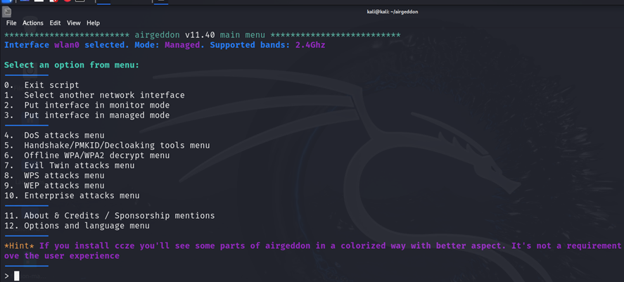

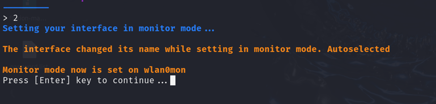

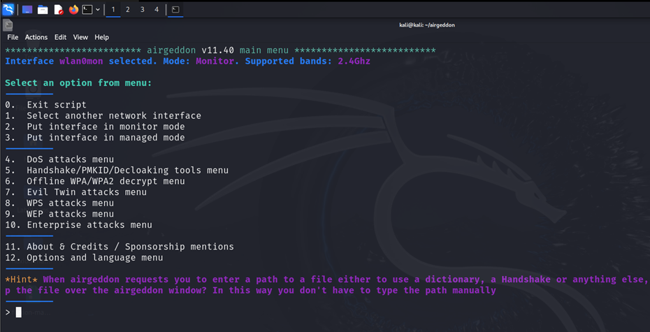

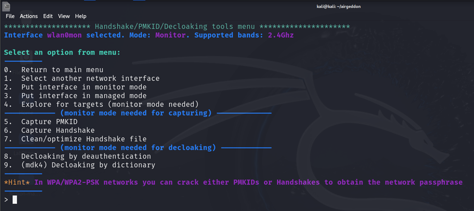

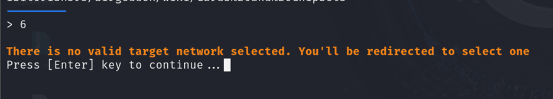

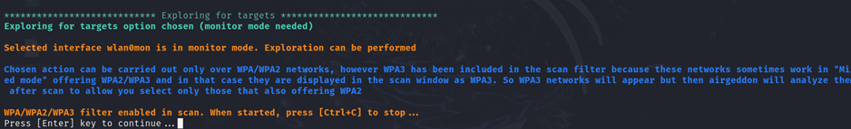

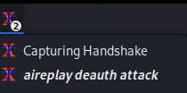

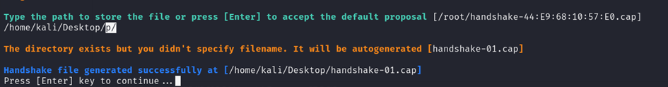

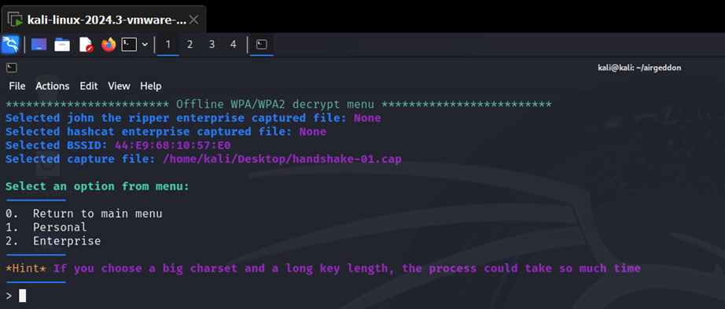

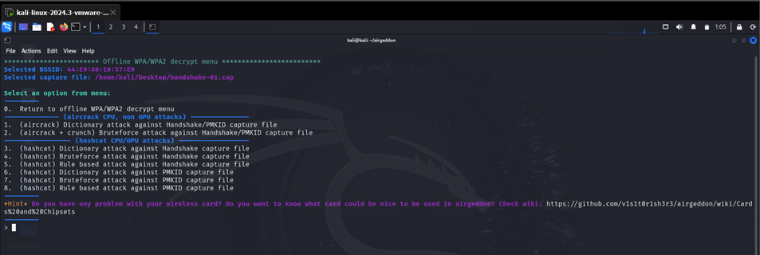

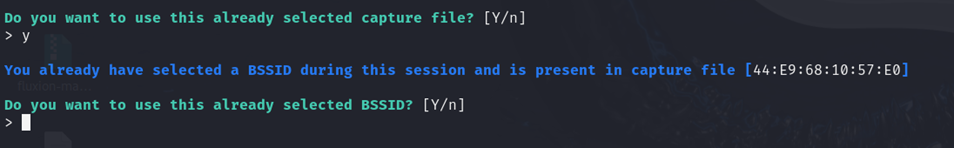

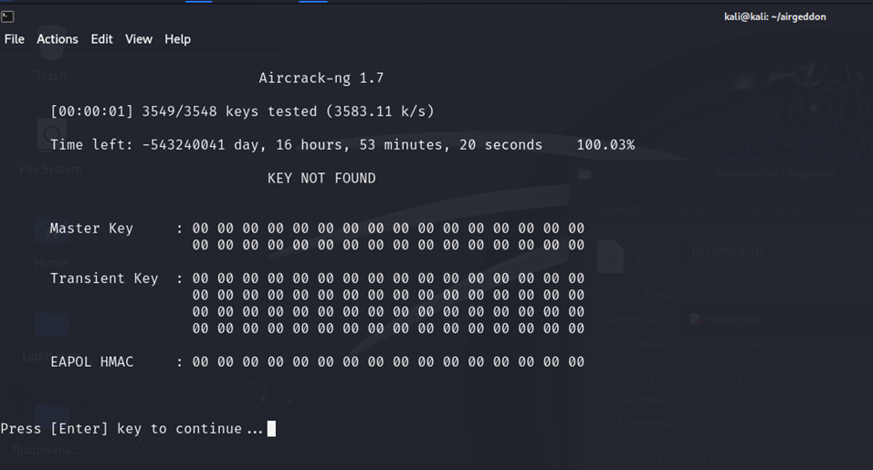

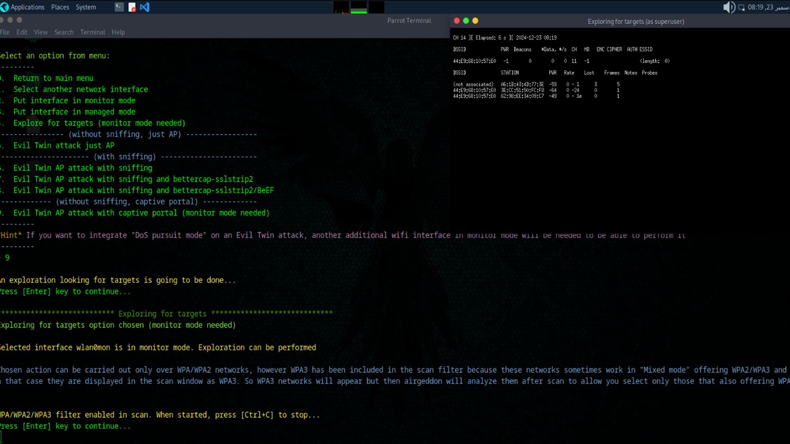

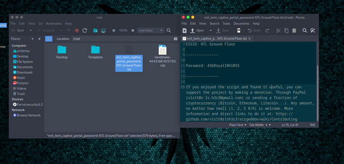

	

	                                           

	

Report on Airgeddon Project

1. Topic Introduction

Objective: To explore the functionality and applications of Airgeddon, a versatile tool designed for wireless network auditing and penetration testing.

Content: 

This project discusses Airgeddon to demonstrate its capability in enhancing wireless network security. The increasing use of WiFi networks in modern society has made them a prime target for cyberattacks. Tools like Airgeddon are necessary to identify vulnerabilities and strengthen networks.

Motivation: The purpose of the project is to understand the procedures of wireless auditing and deploy effective measures in enhancing network security.

 2. Description of Tool/Technique Used

Overview of Tool:

Name: Airgeddon

Version: Release 105 (version 11.40)

Why Chosen: The reason for using Airgeddon is that it can be adapted to perform such activities like wireless network auditing, handshakes, and assessing network strength. This tool comes with an intuitive interface, along with welldocumented information, so it can be used effectively by anyone, from new to experienced users.

Important Features Utilized:

Wireless network discovery

Deauthentication attacks

Capture of WPA/WPA2 handshake

Dictionary attack/Password Cracking

Fake AP creation

Example:

Airgeddon's enhanced wireless audits make it possible to simulate realistic attack scenarios for users; this makes it possible for them to improve their networks' defenses. Below is a screenshot of the tool while in action.

Requirements:

Some Requirements to carry the attacks are as follows:

Hardware Requirements: 

1. Wireless Network Adapter: 

   	An adapter capable of monitor mode and packet injection (e.g., Alfa AWUS036NHA or TP-Link TL-WN722N). 

2. Secondary Wireless Interface (Optional): 

   	Only required for conducting dual-interface tasks like simultaneous scanning and attacking. 

3. System:

A desktop computer or laptop that possesses adequate processing capabilities and a minimum of 4GB of RAM.

Software Specifications: 

1. OS:

Kali Linux. As it already has a plethora of built-in utilities that are set to use out of the box and, therefore compatible.

2. Airgeddon:

11.20 (Release 105) or latest

3. Dependencies:

	Ensure that all the prerequisites to run Airgeddon are installed, such as `aircrack-ng`, `iwconfig`, and `mdk3`.

Networking Requirements: 

1. Target Network: 

A test network specifically created for learning purposes. Before conducting an audit on any network, ethical and legal permission is required to be acquired.

Skill Requirements: 

1. Basic Linux knowledge

Knowledge of the directives required for moving around and deploying tools using a Linux platform. 

2. Wireless Networking:  

Understanding of Wi-Fi protocols, including WPA/WPA2 as well as its vulnerabilities 

3. Ethics:  

Familiarization with ethical hacking principles or best practices, along with local statutes to ensure safe use of tools.

Miscellaneous Requirements: 

1. External Antenna (Optional):

To increase signal strength for weak networks. 

2. Power Supply:

 	To provide constant power to carry out long operations.

3. Progress

Objective: Provide a chronological breakdown of the project milestones.

Details of Activities:

Topic Selection: The project topic, Airgeddon, was chosen on Dec 16, 2024, due to its relevance to wireless security.

Sample Attack: A sample attack was performed on Dec 18, 2024, to familiarize the team with the tool and its features. No major issues were encountered during this phase.

Hardware Limitation: On Dec 19, 2024, we realized that having only one wireless interface was insufficient for simultaneous scanning and attacking. This issue was addressed by borrowing an additional interface from a friend on Dec 20, 2024.

Final Attack: The final attack was performed on Dec 21, 2024, with both interfaces in use. Screenshots and detailed steps were recorded for documentation purposes.

4. Demonstration of Attacking Techniques

Objective:
To demonstrate Airgeddon’s ability to identify and exploit vulnerabilities in a wireless network.

4.1 & 4.2 Deauth Attack and Handshake Capture

Goal:

Perform a deauthentication attack to disconnect clients from a wireless network and capture the WPA/WPA2 handshake for further analysis.

Objective:

Conduct a deauthentication attack on the target network to briefly drop devices from the targeted network and capture the handshake packet when the devices try to reconnect to the attacked network as follows.

Details of Deauth attack:

First start the airgeddon tool:

	The following screen will appear and now the tool will check for necessary required sub tools:

	 

Now the tool/script will ask you to select an interface to conduct the attack.

Note: if you are using kali virtual machine you will get the first interface as eth0(Do not select this one) and also you need to have two external wireless adapters to carry out a proper attack.

Select one of the two wireless interface. We have selected the 2nd one.

You will get the following interface:

First you need to put your network interface into monitoring mode to do that enter 2:

	Press enter and you will be back to this interface:

	

	Note: But see on the top most of the terminal you will see that now your network interface is in monitoring mode (You are all set to go).

Now focus on the options from (4 - 10). You will see Handshake/PMKID/Deloaking tools menu. Press to enter in the menu.

We are interested in the capture of handshake file so we will press 6 to start the attack.

There is no target network selected. Press enter and you will see a magic.

Press enter to scan targets near you and wait for 30 seconds and then press Ctrl + C to stop scanning.

You will get the following interface:

Note: The * sign indicates the targets with clients connected.

Now select the target network in our case we will select NTL Ground Floor as we have the permission to attack this network (Never attack the network you don’t have permission to) You will get the following options.

Note:

a. Deauth / disassoc amok mdk4 attack: This is a method used to disrupt the connection between a device and a wireless access point (AP). The "deauth" (de-authentication) and "disassoc" (disassociation) attacks send spoofed packets to disconnect users from the Wi-Fi network. The term "mdk4" refers to a tool that allows multiple types of wireless attacks, including this one.

b. Deauth airplay attack: Similar to the above, this attack specifically targets the Wi-Fi devices using a method to forcefully disconnect them from the network. "Airplay" is often associated with frameworks used in Wi-Fi testing, targeting devices that are communicating over the air to induce reconnection attempts or to capture handshake data.

c. Auth DoS attack: An authentication denial-of-service (Auth DoS) attack aims to overwhelm a network with authentication requests, causing legitimate devices to be unable to connect. This attack exploits the way WPA/WPA2 authentication works and can be used to disrupt the availability of the network.

In our case we will be going with the 2nd method to deauth the clients connected to the network.

The tool is asking you to select a time interval in which after it sends the deauth packets until a handshake file is captured. We will go with the default timer.

Press enter to the start the attack.

As you can see two external windows are doing the work for you.

Now if the attack is successful you will be prompted to enter a path where to store the captured handshake file.

	In our case we will give the Desktop for our convenience.

	

	To confirm that our file is stored in the specific directory.

	

	

Focusing on our tool now you will get the following interface

But just focus on the top of the terminal, you will get the details about our target network. But for now we will go back to our main menu.

Handshake file details (We thought it will be better to add this)

As you can see we have the WPA key in encrypted form and that’s all for this attack. Further information on how to decrypt this key or match the hash of the key is in the next sections.

Methodology:

•A wireless adapter is used in monitor mode to carry out the attack

•Handshake packets are saved in a cap file for further analysis such as password cracking

Use case:

This method illustrates how attackers can use the weaknesses of the network to steal encrypted authentication data. The configurations must be secure.

4.3 Dictionary Attack

Objective: Crack the WPA/WPA2 password using the captured handshake.

Methodology:

Load the handshake file into password-cracking (Provided with Airgeddon)

Attempt password guessing using a dictionary or brute force technique.

Details of Dictionary/Brute Force Attack:

Coming back to the main menu:

Select the 6. Offline WPA/WPA2 decrypt menu option.

 

Focus on the top of the terminal where the information is given about the decrypt methods and the selected handshake file. Select the option depending on the network you attacked (if it was enterprise select 2nd option and if it is simple select the 1st option). In our case we have selected 1st option.

You will be treated with the following menu:

Note: There are lots of offline attacks you can perform using airgeddon. In this report we are covering “(aircrack) Dictionary attack against Handshake/PMKID capture file”  attack

Carrying the attack:

The tool will ask you to select a handshake file but if you have already selected a target network and captured a handshake file, the tool will automatically select the captured file.

Press Y to continue

Now you will get a prompt to enter the path for a file that contains password for dictionary attack (You can find one on the internet that contains compromised passwords). In my case I have a file stored on the Desktop.

Press enter to start the attack.

Note: The dictionary attack will only be successful if your target network has a compromised password like “12345678” or “0000000” and like that.

Use case:

A dictionary attack is used to crack WPA/WPA2 passwords by systematically testing a list of pre-defined potential passwords against the captured handshake to find the correct one.

4.4 Evil Twin Attack

Objective: Create a fake access point to trick users into sharing their Wi-Fi password.

Methodology:

Configure Airgeddon to create a fake AP.

Broadcast the rogue AP and monitor connections.

Collect authentication details entered by unsuspecting users.

Note: Parrot OS is used for this attack because it’s better at this attack and does not get interrupted

Since we have already conducted multiple attacks and understood the interface we will just move to main points of this attack.

Details of Evil Twin Attack:

Return to main menu and select Evil twin Attack

Start evil twin attack with captive portal at the end

Search and choose the network as before

Use the Deauth and Disassoc attack

Use recently used handshake

Choose the language and start attack

Attack Screen

User’s End Screen

Password will be stored at given Location

5. Airgeddon Limitations

Known Issues:

Hardware Dependency: Requires compatible wireless adapters for optimal performance.

Ethical Considerations: Improper use could lead to legal consequences.

Manual Intervention: Some tasks lack automation, increasing the complexity for beginners.

Detection Risks: Intrusion detection systems (IDS) can identify activities like deauthentication attacks.

6. Mitigation (If Any)

Challenge:
Some networks were not detected during the discovery phase due to low signal strength.

Mitigation:

Used an external antenna to boost signal reception.

Optimized Airgeddon’s settings for better range detection.

[Insert Screenshot of Successful Mitigation]

7. Conclusion

Summary:
The project successfully utilized Airgeddon for wireless auditing. Key objectives, such as handshake capturing and vulnerability identification, were achieved.

Future Work:
Future analysis could explore additional modules of Airgeddon, such as Evil Twin attacks, or incorporate other tools for comprehensive penetration testing.

Personal Takeaway:
This project highlighted the practical applications of cybersecurity tools and reinforced concepts related to wireless network vulnerabilities.

Extra Notes:
Ensure compliance with legal and ethical guidelines. Replace placeholders with actual screenshots and data.

